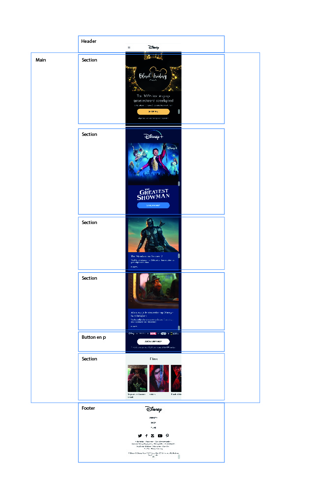
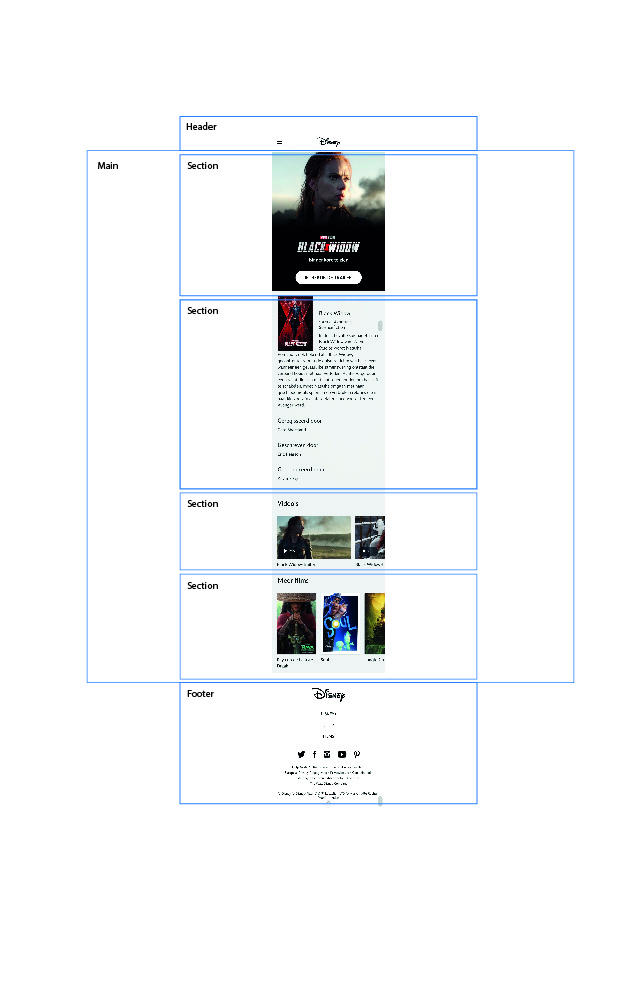
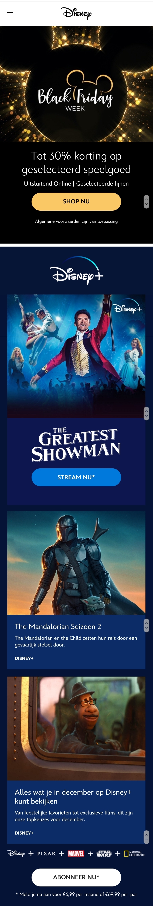
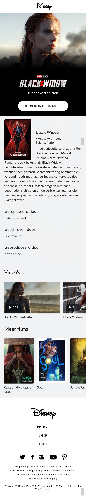

# Procesverslag
**Auteur:** -Zahra Ahmadi-

Markdown cheat cheet: [Hulp bij het schrijven van Markdown](https://github.com/adam-p/markdown-here/wiki/Markdown-Cheatsheet). Nb. de standaardstructuur en de spartaanse opmaak zijn helemaal prima. Het gaat om de inhoud van je procesverslag. Besteedt de tijd voor pracht en praal aan je website.

## Bronnenlijst
1. -bron 1: Disney https://disney.nl/ 
2. -bron 2- Plaatje Black Widow https://www.marvel.com/movies/black-widow
3. -bron 3- Plaatje Raya en de draak https://disney.nl/films/raya-en-de-laatste-draak
4. -bron 4- Font 'The greatest showman' https://famfonts.com/greatest-showman/#:~:text=The%20Greatest%20Font%20by%20Franco,It%20is%20a%20free%20font.
5. -bron 5- Black Friday plaatje https://disney.nl/
6. -bron 6- Disney Plus logo https://www.internetmatters.org/nl/hub/news-blogs/disney-plus-review/
7. -bron 7- The Greatest Showman plaatje https://kinepolis.be/nl/events/greatest-showman
8. -bron 8- Mulan plaatje https://disney.nl/films/mulan-2020
9. -bron 9- Disney logo https://purepng.com/photo/1586/logos-disney-logo
10. -bron 10- The Mandalorian plaatje https://www.gamesradar.com/the-mandalorian-season-2-episode-1-easter-eggs-references/
11. -bron 11- Plaatje https://lumiere-a.akamaihd.net/v1/images/disneyplusdecembersoulmobile_m_2e73201b.jpeg?region=0,0,800,600 

## Eindgesprek (week 7/8)

-dit ging goed & dit was lastig-

**Screenshot(s):**

-screenshot(s) van je eindresultaat-

## Voortgang 3 (week 6)

-same as voortgang 1-

## Voortgang 2 (week 5)

-same as voortgang 1-

## Voortgang 1 (week 3)

### Stand van zaken

-dit ging goed & dit was lastig-

**Screenshot(s):**

-screenshot(s) van hoe ver je bent met korte uitleg-

### Agenda voor meeting

-samen met je groepje opstellen-

| student 1      | student 2          | student 3    | student 4        |
| ---            | ---                | ---          | ---              |
| dit bespreken  | en dit             | en ik dit    | en dan ik dat    |
| an dat ook nog | dit als er tijd is | nog een punt | dit wil ik zeker |
| ...            | ...                | ...          | ...              |

### Verslag van meeting

-na afloop snel uitkomsten vastleggen-

## Breakdownschets (week 1)

-uitwerken voor de 1e werkgroep - eind van de eerste week-

## Intake (week 1)
-uitwerken voor de kick-off werkgroep - begin van de eerste week-

**Je startniveau:** -Rood-

**Je focus:** -Responsive-

**Je opdracht:** -De website van Disney.nl namaken.-

**Screenshot(s) van de eerste pagina (small screen):**

**Screenshot(s) van de tweede pagina (small screen):**

