# Procesverslag
**Auteur:** -Zahra Ahmadi-

Markdown cheat cheet: [Hulp bij het schrijven van Markdown](https://github.com/adam-p/markdown-here/wiki/Markdown-Cheatsheet). Nb. de standaardstructuur en de spartaanse opmaak zijn helemaal prima. Het gaat om de inhoud van je procesverslag. Besteedt de tijd voor pracht en praal aan je website.

## Bronnenlijst
1. -bron 1: Disney https://disney.nl/ 
2. -bron 2- Plaatje Black Widow https://www.marvel.com/movies/black-widow
3. -bron 3- Plaatje Raya en de draak https://disney.nl/films/raya-en-de-laatste-draak
4. -bron 4- Font 'The greatest showman' https://famfonts.com/greatest-showman/#:~:text=The%20Greatest%20Font%20by%20Franco,It%20is%20a%20free%20font.
5. -bron 5- Black Friday plaatje https://disney.nl/
6. -bron 6- Disney Plus logo https://www.logo.wine/logo/Disney%2B?logo=White 
7. -bron 7- The Greatest Showman plaatje https://kinepolis.be/nl/events/greatest-showman
8. -bron 8- Mulan plaatje https://disney.nl/films/mulan-2020
9. -bron 9- Disney logo https://purepng.com/photo/1586/logos-disney-logo
10. -bron 10- The Mandalorian plaatje https://www.gamesradar.com/the-mandalorian-season-2-episode-1-easter-eggs-references/
11. -bron 11- Plaatje https://lumiere-a.akamaihd.net/v1/images/disneyplusdecembersoulmobile_m_2e73201b.jpeg?region=0,0,800,600 
12. -bron 12- Plaatje Soul https://www.google.com/search?q=soul&rlz=1C5CHFA_enNL866NL866&sxsrf=ALeKk00nZ8mQqbwcC3pjP15bLdSjaXn-Qw:1606675545855&source=lnms&tbm=isch&sa=X&ved=2ahUKEwiXzLfptKjtAhXB-KQKHbxwD14Q_AUoAXoECAYQAw&cshid=1606675689950760&biw=971&bih=878#imgrc=4eHxJjpXwMjrWM 
13. -bron 13- Tekst en video's Black Widow https://disney.nl/films/black-widow 
14. -bron 14- Trailer video http://www.hd-trailers.net/movie/black-widow/

## Eindgesprek (week 7/8)

-dit ging goed & dit was lastig-

**Screenshot(s):**

-screenshot(s) van je eindresultaat-

## Voortgang 3 (week 6)

### Stand van zaken

-Ik ben nu klaar met de mobiele versie. Die ziet er helemaal goed uit en nu ga ik verder met het responsive maken van de website. 

 **Screenshot(s):**

-screenshot(s) van hoe ver je bent met korte uitleg-

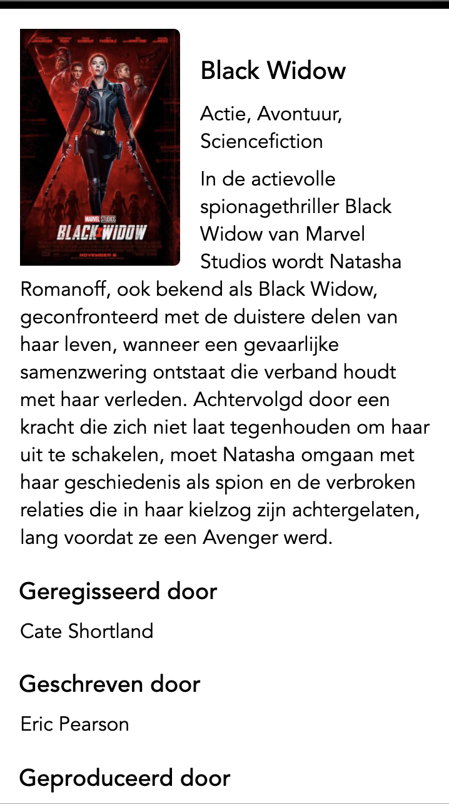
Tekst om het plaatje gekregen!

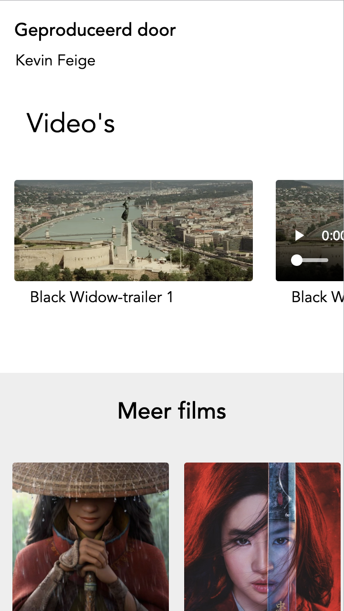
De video's staan er!

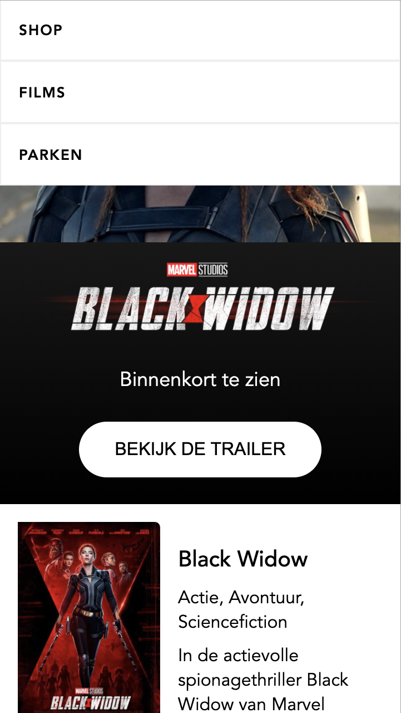
Hamburgermenu werkt volledig en staat er volgens mijn wens.

### Agenda voor meeting

-samen met je groepje opstellen-

| Zahra		     | Thijs	          | Rosan	     | student 4        |
| ---            | ---                | ---          | ---              |
| Geen vragen | | Geen vragen | Geen vragen
| ...            | ...                |        | ...              |

### Verslag van meeting

## Voortgang 2 (week 5)

### Stand van zaken

-Ik ben verder gegaan met het maken van de hamburgermenu en de horizontale scrollbar en ze zeiden beide gelukt! Echter is er één klein dingetje bij de hamburgermenu waar ik niet zo tevreden over ben, maar als ik daar nog even naar kijk, weet ik dat het goed komt. Ik heb de tweede pagina nu ook al gemaakt. Daar moet ik alleen de tekst om het plaatje van de Black Widow poster zien te krijgen en dan ben ik voor de mobiele versie klaar. Dat gaat me deze week nog wel lukken en dan zal ik de volgende week verder gaan met het responsive maken van de website. #spannend, maar leuk.

**Screenshot(s):**

-screenshot(s) van hoe ver je bent met korte uitleg-

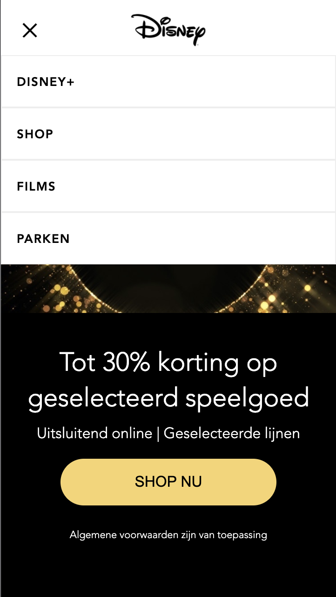
Hamburgermenu staat er!

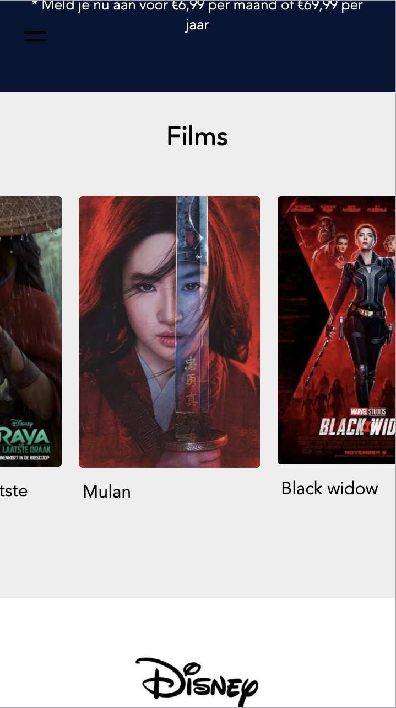
De horizontale scrollbar staat er ook en werkt helemaal volgens verwachting.

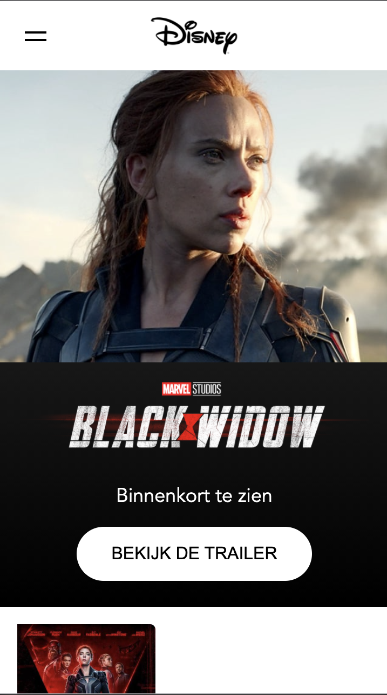
Header van de tweede pagina.

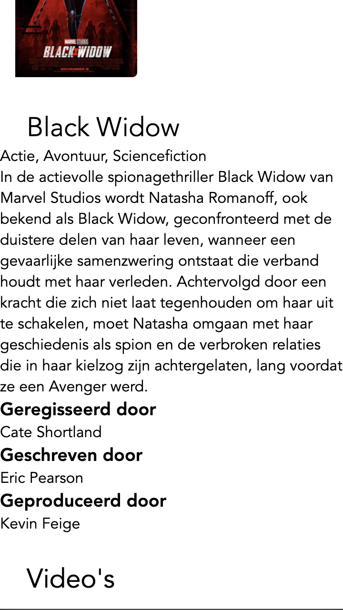
Hier moet ik de tekst dus om die foto zetten.

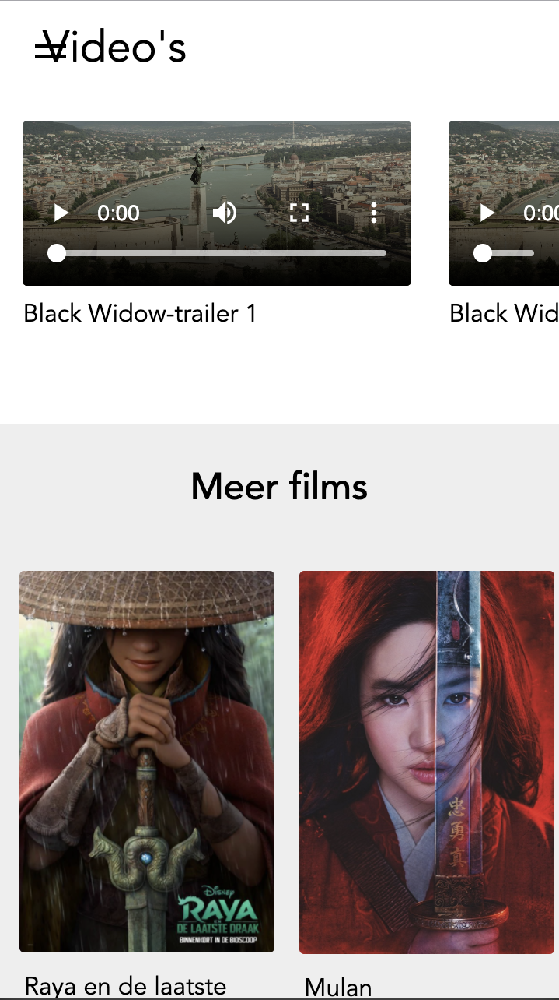
Hier de video's neergezet. Ook goed gelukt met flexbox. 

### Agenda voor meeting

-samen met je groepje opstellen-

| Zahra		     | Thijs	          | Rosan	     | student 4        |
| ---            | ---                | ---          | ---              |
| - Hamburgermenu 
scrollt mee (blijft 
niet op zijn plek zitten)| Geen vragen. | Animatie |
| ...            | ...                | Hamburgermenu (wat dieper op ingaan)        | ...              |

### Verslag van meeting
De docent heeft me verder geholpen met de enkele kleine problemen waar ik tegenliep. 
Deze heb ik genoteerd en verwerkt in mijn code. Het is nu opgelost.

## Voortgang 1 (week 3)

### Stand van zaken

-Het maken van de website ging echt uitzonderlijk goed. Ik zat lekker te coderen. Ik heb me voor nu ook alleen gefocust op de mobiele formaat, zodra dit helemaal op orde is ga ik verder met de tablet versie en zo bouw ik verder op naar het grote scherm. 
Wat ik heel lastig vond was de hamburgermenu. Ik heb er lang mee zitten spelen, maar ik kwam er uiteindelijk niet uit. En verder is de horizontale scrollbar onder het kopje 'films' niet echt gelukt.-

**Screenshot(s):**

-screenshot(s) van hoe ver je bent met korte uitleg-

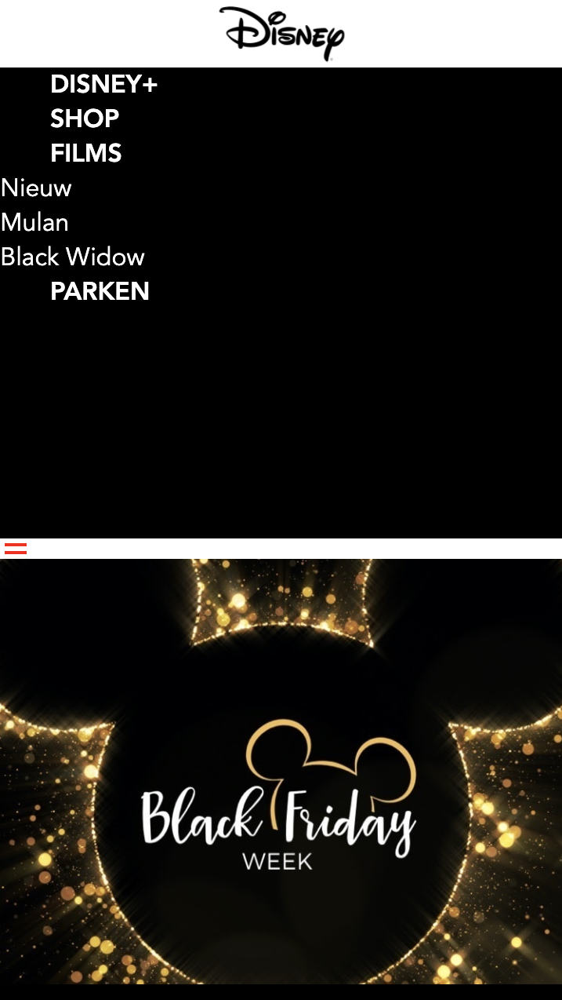
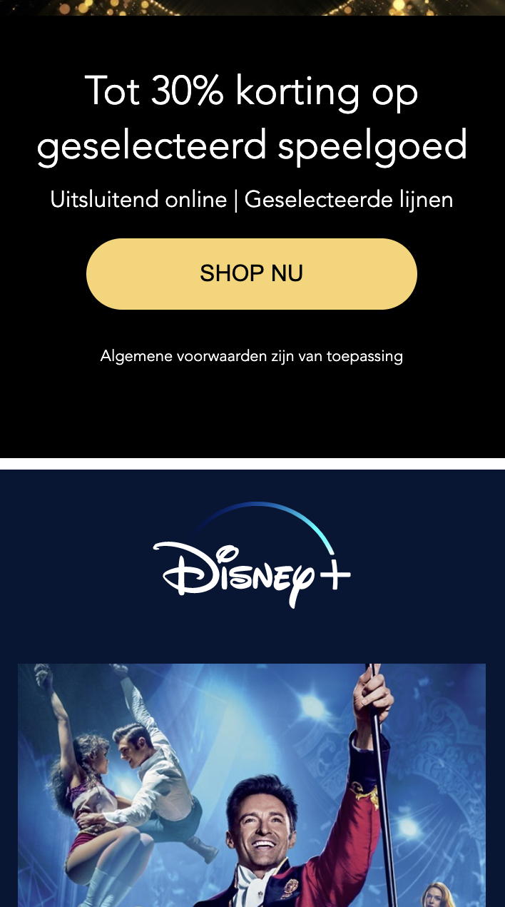
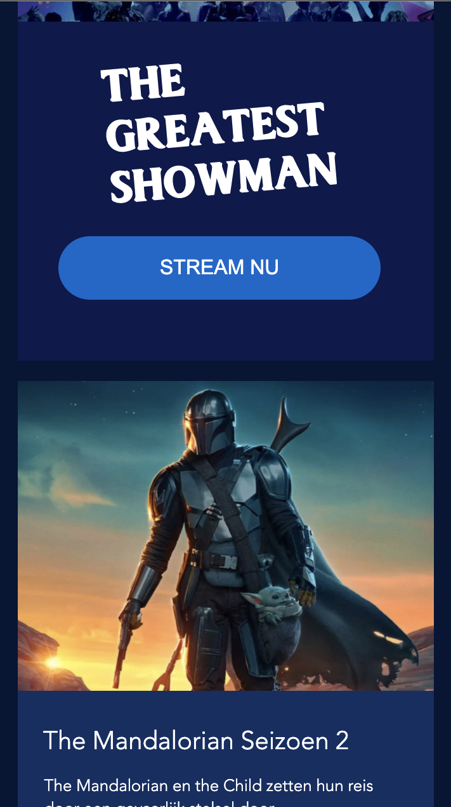
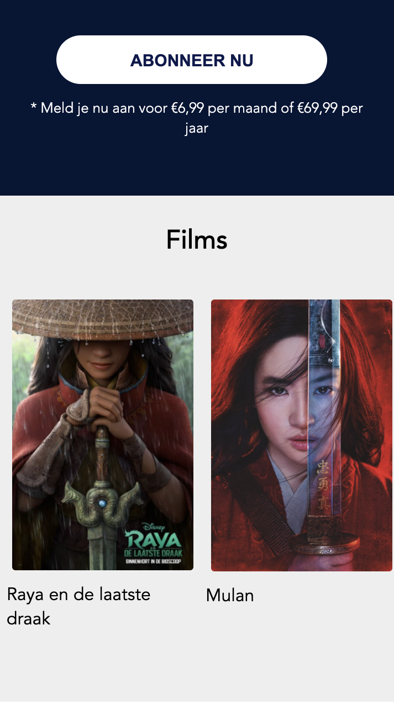
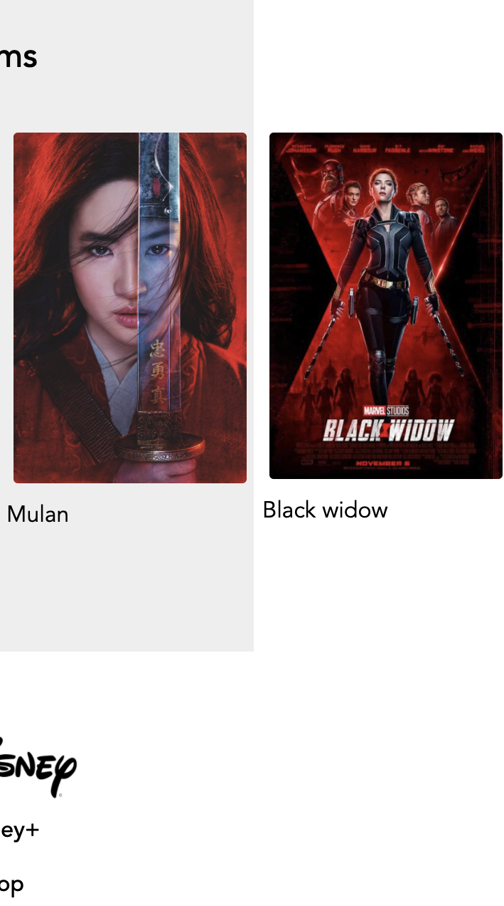
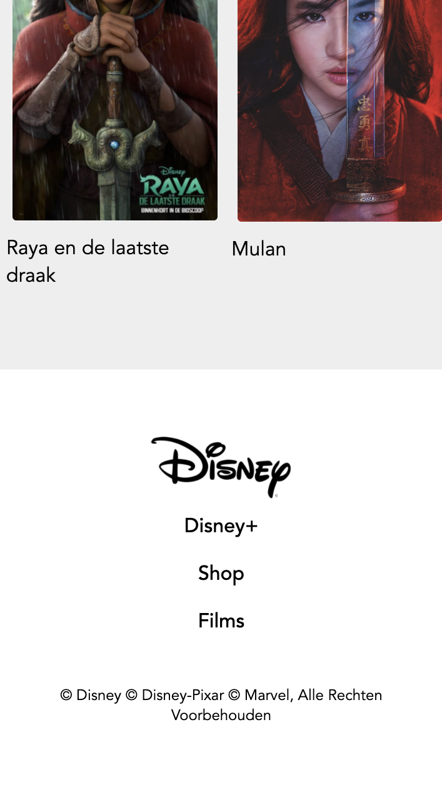

### Agenda voor meeting

-samen met je groepje opstellen-

| Zahra		     | Thijs	          | Rosan	     | student 4        |
| ---            | ---                | ---          | ---              |
| - Hamburgermenu| Plaatje waar is het? | Hamburgermenu | en dan ik dat    |
| - Flexbox (horizontale scrollbar) | Image responsive | nog een punt | dit wil ik zeker |
| ...            | ...                | ...          | ...              |

### Verslag van meeting

-Het gesprek was vrij snel voorbij. We lieten elk onze voortgang zien. 
Ik was goed op weg en ik werd op weg geholpen met de horizontale scrollbar 
die ik wilde maken. Dat is inmiddels ook opgelost! Met het hamburgermenu gaat
het ook goed. Ik heb er nu een staan. Het is nog niet helemaal perfect, maar
daar kan ik de komende week mee verder aan de slag.-

## Breakdownschets (week 1)

-uitwerken voor de 1e werkgroep - eind van de eerste week-

## Intake (week 1)
-uitwerken voor de kick-off werkgroep - begin van de eerste week-

**Je startniveau:** -Rood-

**Je focus:** -Responsive-

**Je opdracht:** -De website van Disney.nl namaken.-

**Screenshot(s) van de eerste pagina (small screen):**

**Screenshot(s) van de tweede pagina (small screen):**

